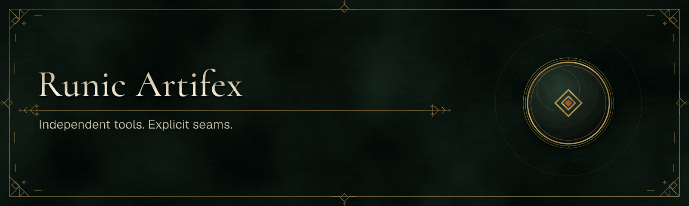

# Runic Brand

> **Design status:** canonical source. Approved assets are deployed to the Runic
> Artifex organization, product repositories, package metadata, and applications.

Runic Brand is the source and material-rendering system for the Runic Artifex
product family. Vector paths define typography, sigils, frames, and ornamental
construction. A deterministic raster stage turns those masks into the canonical
stone, engraved metal, patina, and relief artwork used on public surfaces.

The vector layer remains inspectable and portable, but it is construction source,
not the finished presentation asset. Canonical distributable artwork is PNG.

## Included identities

- Runic Artifex
- Runic Toolkit
- CS-WebUI
- Runic Flow
- Runic Assets
- Runic Translations
- Runic Translations Editor
- Runic Command Line
- Runic Artifex Documentation

Each identity has a distinct geometric sigil, accent, tagline, and repository
reference while sharing the same palette, typography, frame grammar, medallions,
and material model.

## Generated formats

| Format | Dimensions | Intended use |
| --- | ---: | --- |
| `social` | 1200 × 630 | GitHub, social previews, release announcements |
| `banner` | 1600 × 480 | README and documentation headers |
| `icon` | 512 × 512 | Repository, package, application, and profile icons |

Each format includes an SVG construction source and a materialized PNG. The
`social-overlay.svg` file contains only vector masks for the optional live WebGL
material study. Do not substitute the SVG source for the canonical PNG on a
public brand surface.

## Use the CLI

```bash
npm ci
npm run generate

node dist/cli.js list
node dist/cli.js render runic-flow --format social --out flow.source.svg
node dist/cli.js render runic-flow --format icon --png --scale 2 --out flow@2x.png
node dist/cli.js render-all --out assets/generated
```

The package exposes the same renderer programmatically:

```ts
import { renderBrandAsset } from "@runic-artifex/brand";

const svg = renderBrandAsset("runic-translations", "banner");
```

## Brand Studio

```bash
npm run dev
```

The studio shows the canonical material PNG by default. Its optional live mode
combines the transparent vector masks with a WebGL 2 stone shader for material
exploration; it is not silently substituted for the deterministic export.

## Deploy in the workspace

The generated PNGs are copied into each sibling repository under
`.github/assets/brand/`. Product repositories receive their own identity;
integration-only repositories receive the Runic Artifex family identity, and
Toolkit examples receive Toolkit artwork.

```bash
npm run sync:workspace
npm run check:workspace
```

The synchronization script never changes README or package metadata. Those
surfaces remain owned and reviewed by their consuming repository.

The `runic-site` repository receives the Runic Artifex family identity for the
apex project website, plus the product icons used by its family overview.
`runic-docs` keeps the distinct Documentation identity for the technical portal.

## Verification

```bash
npm audit
npm run check
npm test
```

Tests prove that:

- every identity and format renders deterministically;
- typography contains vector paths rather than runtime font references;
- transparent overlays contain no material background;
- committed vector sources exactly match the renderer;
- PNG dimensions match the canonical format; and
- the CPU materializer and WebGL study retain deterministic contracts.

See [docs/BRAND_GUIDELINES.md](docs/BRAND_GUIDELINES.md) before adding or
changing an identity.

## Publication status

This repository is public. `@runic-artifex/brand` remains a private workspace
package (`"private": true`) and is not published to npm. The package name in
source is not a claim of registry availability.

## License

The code, original vector geometry, and generated brand assets are licensed
under the MIT License. Font and runtime dependency notices are recorded in
[THIRD_PARTY_NOTICES.md](THIRD_PARTY_NOTICES.md).
